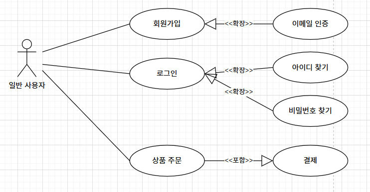

# 큰 글자
## 큰 글자
### 큰 글자
###### 작은 글자

---

그냥 글자

---

안녕하세요 벌써 **배고파**요

---

- 순서 없는 리스트 아이템1
    - 아이템에서 또 리스트 아이템1
    - 아이템에서 또 리스트 아이템2
    - 아이템에서 또 리스트 아이템3
- 순서 없는 리스트 아이템2
- 순서 없는 리스트 아이템3

1. 순서 있는 리스트 아이템1
    1. 아이템에서 또 리스트 아이템1
    2. 아이템에서 또 리스트 아이템1
    3. 아이템에서 또 리스트 아이템1
2. 순서 있는 리스트 아이템2
3. 순서 있는 리스트 아이템3

---

글자 쓰다가 개행  
하고 싶으면 띄어쓰기 뒤에 2번해줘야 함  
이렇게 안됨

---

[데모 사이트](https://www.naver.com/)

---

  
이미지를 클릭하면 사이트로 이동됩니다.

---

`1왼쪽 물결 기본 (코드에 많이 사용)`

---

목록

목록1

목록2

목록3

목록4

## 🚩 프로젝트 목표

찬영이가 추가함

## ❓ 프로젝트 선정 이유

찬영이가 추가함

---

## 👍 연습 프로젝트

김무성 작성

---

회원
	회원 가입, 로그인, 아이디 찾기, 비밀번호 찾기, 내 정보

상품
	상품 조회, 상품 목록, 상품 정보, 상품 리뷰

주문
	주문하기, 장바구니, 배송지 입력, 결제 수단 선택

